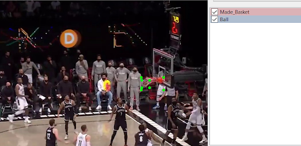
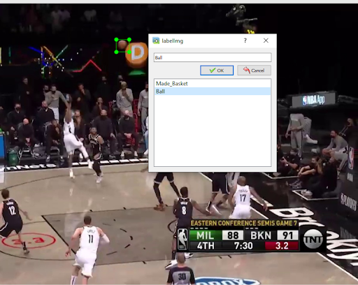
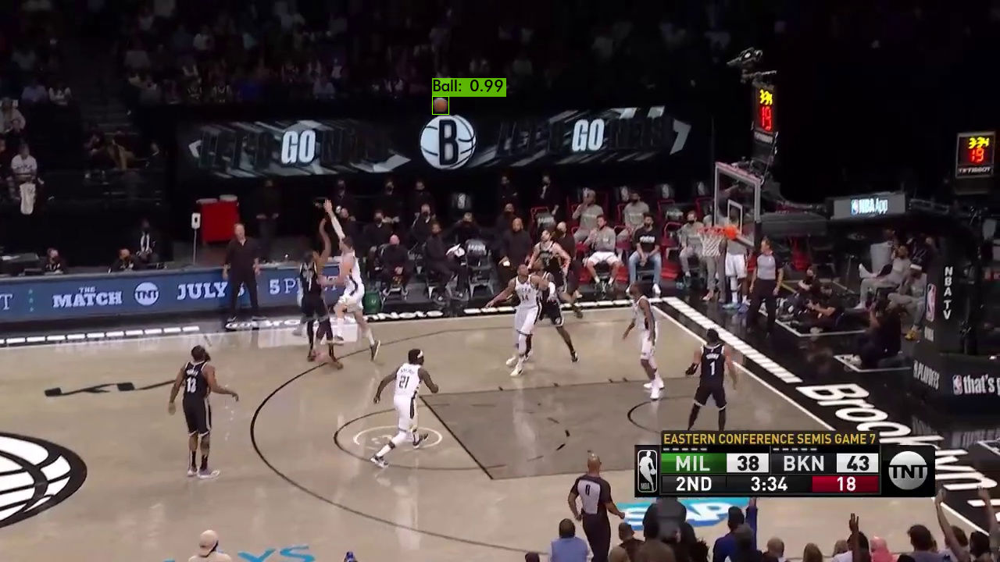
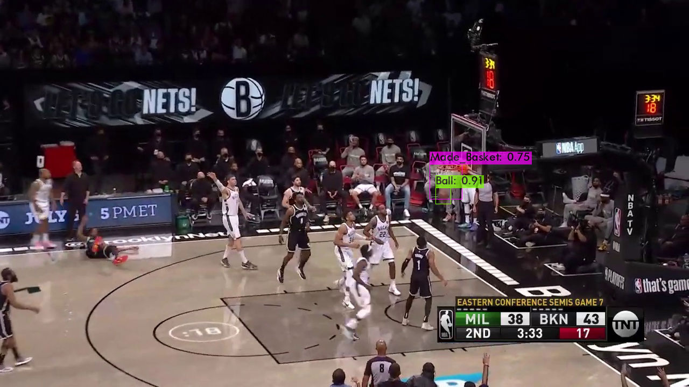
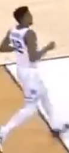
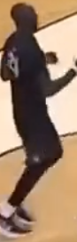

# Object Tracking in the NBA: Automating Statistical Recording 
For this project, I wanted to incorporate something I love very much: Basketball! I am an NBA fanatic and my interest in how Advanced analytics is changing basketball is a major reason I decided to pursue data science. Machine learning plays a huge part in NBA franchises. I find this fascinating and wanted to attempt a project in this world.

This project will build a program that will be able to identify the ball, made baskets, track players on their respective teams and possession of the ball using a custom trained neural network. I will build this model using traditional broadcast footage as I couldn’t find anything better and figured it was the most practical for anyone who might use this program. Some inspiration behind this project comes from a blog post from an individual who attempted to train a model to create a basketball highlight reel. Although the primary goal of this model is to automate statistical recording, I will attempt to create a highlight reel as well.

For the custom object training I referenced and built off of [this colab notebook](https://colab.research.google.com/drive/1Mh2HP_Mfxoao6qNFbhfV3u28tG8jAVGk). That notebook is explained in [this video](https://www.youtube.com/watch?v=10joRJt39Ns&feature=emb_logo&ab_channel=TheAIGuy). The AI Guy is an awesome resource and fast tracked my understanding of YOLO Object Detection and the Darknet Framework. 

For Object Tracking, I built off of a framework set up [here](https://github.com/pythonlessons/TensorFlow-2.x-YOLOv3/blob/master/yolov3/utils.py). Again, having this notebook really sped up my ability to impliment the player tracking feature.

## Project Goal
Build a model that identifies highlights in a basketball game and tracks statistics. Model should identify the basketball, made baskets, track and determine the team of players. 

## Data

### Scraping
I decided to use traditional broadcast footage as this is what is primarily available and what would theoretically be fed into the model to produce highlights. If this model were going to be used primarily as a tool to identify statistics, video from stationary areas around the court could be used. This video is typically not available to the public. The NBA does not release game footage so I had to screen record games on youtube to get testing and training data.

### Labeling Data
Since I could not find a labeled image set of NBA basketball games, I had to create my own. I started this process by screen recording 4 separate games on Youtube. In order to train an object detection system to identify new objects, it must be trained on labeled images. Since my dataset is composed of videos, I wrote a script that reads in a video and extracts the frames. This script is in the [ImageCapture](ImageCapture/ImageCapture.ipynb). I then used [labelimg](https://github.com/tzutalin/labelImg), a graphical image annotation tool, to label the basketball and “made baskets” manually for 1500 images. This was all the data I used for the training of my model.

  |  

## Pre-processing
Although labeling the data was a time-consuming process, I did not have to do much pre-processing of the data. This mainly consisted of manually reviewing the images and removing non-relevant images from the dataset that did not include actual game footage. I did this as I labeled the images.

## Modelling Process
I decided to use the [YOLO](https://pjreddie.com/darknet/yolo/)  object detection system for its speed. Yolo differs from other models in that it is able to look at the whole image in one pass rather than region proposals created by a separate network. Yolo splits the entire image into an SxS grid and then produces n bounding boxes. For each bounding box, a class probability and offset values are computed. This makes it much faster than other algorithms.

My first step was to train a yolo object detection model on my custom classes which were a basketball and made baskets.  I used Google Colab to train the model as it comes with a free GPU connected to the notebook. I began by moving my custom dataset into my cloud VM and configuring the necessary files for training based on the two classes I am trying to find. I used 64 batches, 16 subdivisions. I set the max batches to 4000 ( 2000 * # of classes). I set the steps to 80% and 90% of my max_batches. I kept everything else similar to how the Yolov3 model was initially trained with the exception of adjusting the number of classes where necessary. I also reset the filters on each layer to 21 ( ( # of classes + 5) * 3). 
I then uploaded the pre-trained weights that Yolov3 is initially trained on. It is trained on the coco dataset which has 80 classes that it can predict. Finally, I trained my model. Training to completion took about ≈ 12 hours. This process can be found in the  [custom-baskbetball-trainer notebook](custom-baskbetball-trainer.ipynb)

Here is what that detector can pick up in an image. 

Basketball Detection       |  Made Basket Detection
:-------------------------:|:-------------------------:
  |  

Unfortunately, due to constantly losing connection to my VM, I had to complete training in multiple steps. I did not have to start from scratch each time as my weights were saved after 100 iterations. However, this did make performance tracking on my model training very difficult as I could not easily save any meaningful plots without diving into the source code for the models. I did not do this but it might be a next step with more time.

### Player Tracking
I then used pre-trained weights for player detection. I built off of the Deep Sort framework to attempt to track the players through time rather than just identifying them. Since the players are being tracked over a series of frames, I can assign features to them. This code can be found in the [deep_sort directory](./deep_sort).

Here is what player tracking looks like, notice each player maintains there "id" throughout the clip:

### Team Identification
The [color_detect](deep_sort/color_detect.py) file uses openCV to return the ratio of white pixels to all pixels in each players bounding box. Since white jerseys should have low values, the player's team can be determined by examining the color ratio of the identification box compared to a running average.

Light Team                 |  Dark Team
:-------------------------:|:-------------------------:
  |   
Ratio= .03 | Ratio = .35

### Team Possession
The program identifies when the ball is in the bounding box of a player and identifies the player’s team. These numbers are stored and averaged to determine which team has possession of the ball and this is displayed on the video.

### Highlight Splicing
The program returns a list of “made basket” frames which can be used to splice together a “highlight reel”.
The video analyzation will return a list of "made basket" frames. With that we can use the [slice_video file](slice_video.py) to obtain a "highlight reel".

### Putting it all together
This whole process from raw video to highlight reel is shown in the [DeepSort notebook](DeepSort.ipynb).

### Metrics
Unfortunately, I did not have labeled data that identified which players were on each team or which team had the ball. Because of this I wasn’t able to gather exact metrics for these features. I used all of my labeled data that identified the basketball and made baskets to train the model. With more time, I would label more images to run a performance analysis on my model using the [evaluatemAP](evaluate_mAP.py) file from the PYLessons repository. I would need to convert the labeled data into a proper test file. 

This program captures the mean Average Precision of an object detection model. This would be a necessary step if this model were to be optimized and used. Despite the lack of metrics, you can see that the model is tracking in the gifs above.

## Conclusion
The goal of this project was to create a model that would take in raw footage from a basketball broadcast and track the basketball, made baskets, the players, identify different teams, possession of the ball and use this information to log game statistics and even create a highlight reel. I was able to do all of these things with my model which is a great proof of concept.

## Challenges/Future Work
I observed that the identification model gradually degraded over the course of the video. Player tracking proved to be most difficult the more players were moving all around each other. Tracking players for a long period of time is difficult especially with camera cuts. Having a consistent metric throughout the game would help fix this problem, perhaps using jersey numbers. You would need a high resolution video to capture this.

Gathering a large dataset was a very time consuming process. I captured 1500 images from 4 different games. More images from more games would make this model more robust and greatly improve object predictions. The model incorrectly identified a lot of made baskets simply because there was not enough labeled data. Anytime the ball got close to the basket, there was a good chance it would be called a made basket.

Overall, this was an extremely fun and challenging project.

## Technologies/Programs used
- Yolo
- TensorFlow
- OpenCV
- DeepSort
- Darknet
- Python

## Helpful Resources
Truly, too many helpful resources to count, but here are a few that helped me:

  * [Highlight Blog](https://medium.com/swlh/automating-basketball-highlights-with-object-tracking-b134ce9afec2)
  * [Extracting Frames from a Video](https://www.analyticsvidhya.com/blog/2018/09/deep-learning-video-classification-python/)
  * [Labelimg](https://github.com/tzutalin/labelImg)
  * [Yolox3](https://pjreddie.com/darknet/yolo/)
  * [AIGuy Custom Object Detection Video](https://www.youtube.com/watch?v=10joRJt39Ns)
  * [AiGuy Github Repo](https://github.com/theAIGuysCode/YOLOv3-Cloud-Tutorial)
  * [PyLessons Object Detection Model](https://github.com/pythonlessons/TensorFlow-2.x-YOLOv3 )
  * [Understanding mAP](https://pylessons.com/YOLOv3-TF2-mAP/)
  * [Object Detection Google Colab Notebook](https://colab.research.google.com/drive/1Mh2HP_Mfxoao6qNFbhfV3u28tG8jAVGk)

